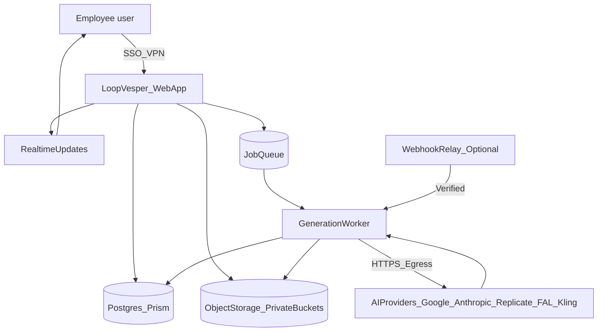

# Loop Vesper — Technical Brief for IT

**Deployment, security, and operational requirements for running Loop Vesper as an internal service**

---

## Overview

Loop Vesper is an internal AI media production platform built with Next.js, TypeScript, and PostgreSQL. This document outlines what IT needs to provision, secure, and operate the platform as an internal service.

**Key question this document answers**: *"What do you need from us, and how do we operate this safely?"*

---

## Deployment topology

### Recommended: VM-only (private internal)

```
┌─────────────────────────────────────────────────────────────────────┐
│                        Internal Network                              │
│                                                                      │
│   ┌──────────────┐         ┌──────────────┐         ┌────────────┐  │
│   │   Employee   │──SSO/VPN──▶│  Web App   │────────▶│  Postgres  │  │
│   │    User      │           │  (Next.js)  │         │  Database  │  │
│   └──────────────┘           └──────────────┘         └────────────┘  │
│                                    │                                  │
│                                    ▼                                  │
│                            ┌──────────────┐         ┌────────────┐   │
│                            │  Job Queue   │────────▶│   Object   │   │
│                            │              │         │  Storage   │   │
│                            └──────────────┘         │  (Private) │   │
│                                    │                └────────────┘   │
│                                    ▼                                  │
│                            ┌──────────────┐                          │
│                            │   Worker     │                          │
│                            │  Process(es) │                          │
│                            └──────────────┘                          │
│                                    │                                  │
└────────────────────────────────────│────────────────────────────────┘
                                     │ HTTPS Egress
                                     ▼
                    ┌────────────────────────────────┐
                    │       AI Providers (External)   │
                    │  Google Gemini/Vertex, Anthropic│
                    │  Replicate, FAL, Kling         │
                    └────────────────────────────────┘
```

### Alternative: Hybrid (if webhooks required)

If providers require webhook callbacks (e.g., Replicate completion notifications) and inbound internet is not permitted to the main app:

- Deploy a minimal, hardened **webhook relay** on a DMZ or cloud edge
- Relay verifies webhook signatures and forwards events internally
- Main application remains fully internal

---

## Network requirements

| Direction | Requirement | Details |
|-----------|-------------|---------|
| **Inbound (users)** | SSO/VPN only | Employees access via corporate VPN; no public internet exposure |
| **Inbound (webhooks)** | Optional | Only if using provider webhooks; otherwise polling-based |
| **Outbound (AI providers)** | HTTPS to external APIs | Google APIs, Anthropic API, Replicate, FAL, Kling |
| **Internal** | App → DB, App → Storage, App → Queue | Standard internal TCP/HTTP |

### Provider endpoints requiring egress

- `generativelanguage.googleapis.com` (Gemini)
- `us-central1-aiplatform.googleapis.com` (Vertex AI)
- `api.anthropic.com` (Claude)
- `api.replicate.com` (Replicate)
- `api.fal.ai` (FAL)
- `api.klingai.com` (Kling official)

---

## End-to-end architecture (data flows)



### Data at rest
- **PostgreSQL**: User accounts, projects, sessions, generation metadata, analytics
- **Object storage**: Reference images (inputs), generated images/videos (outputs)

### Data in transit
- All internal communication over TLS
- External API calls over HTTPS
- Signed URLs for asset access (no public bucket listing)

---

## Access model + responsibilities

### Role definitions

| Role | Provisioned by | Access level |
|------|----------------|--------------|
| **Admin** | IT | Full platform access; user management; analytics |
| **Member** | Admin | Create/view own projects; access shared projects |
| **Viewer** | Admin | Read-only access to shared projects |

### Responsibility matrix

| Function | IT | Product Owner | Engineer |
|----------|-----|---------------|----------|
| VM provisioning | ✅ | | |
| SSO/IdP integration | ✅ | | |
| Network/firewall rules | ✅ | | |
| OS + runtime patching | ✅ | | |
| User access decisions | | ✅ | |
| Application code releases | | | ✅ |
| API security + hardening | | | ✅ |
| Monitoring/alerting config | ✅ | | ✅ |
| Incident response | ✅ | ✅ | ✅ |

---

## Security controls checklist

### Authentication + authorization
- [ ] SSO integration (SAML/OIDC with corporate IdP)
- [ ] Session management with secure cookies
- [ ] RBAC enforced on all API routes
- [ ] Project/session membership checks on data access

### Secrets management
- [ ] API keys stored in environment variables or secrets manager (not in code)
- [ ] Separate keys per environment (dev/staging/prod)
- [ ] Keys rotated on schedule and on suspected compromise

### Debug + dev surfaces
- [ ] Debug endpoints (`/api/debug-*`) removed or gated to admin + non-prod only
- [ ] Development logging sanitized (no PII, no secrets in logs)
- [ ] Error messages do not expose internal stack traces to users

### Dependency + vulnerability management
- [ ] Automated dependency updates (Dependabot or equivalent)
- [ ] Vulnerability scanning in CI pipeline
- [ ] Patch cadence defined (e.g., critical within 48h, high within 1 week)

### Storage security
- [ ] Object storage buckets are private (no public listing)
- [ ] Assets accessed via signed URLs with expiration
- [ ] No direct public URLs to generated content

### Audit + logging
- [ ] Structured logs suitable for SIEM ingestion
- [ ] Admin actions logged (role changes, user provisioning)
- [ ] Generation requests logged with user/project context
- [ ] Log retention aligned with policy (e.g., 90 days)

---

## Environment strategy

| Environment | Purpose | Data isolation | API keys | Access |
|-------------|---------|----------------|----------|--------|
| **Local** | Developer iteration | Local DB/mock | Dev keys (low limits) | Developer only |
| **Staging** | Feature testing, stakeholder preview | Separate DB + storage | Non-prod keys | Internal testers |
| **Production** | Live internal use | Production DB + storage | Production keys | Authorized employees |

### Key rules
- **No shared credentials** between environments
- **No production data** in staging/local
- **Staging must not spend** against production AI budgets
- **Deploys flow**: Local → Staging (auto) → Production (manual promote)

---

## Operational requirements

### Monitoring + alerting

| Metric | Alert threshold | Response |
|--------|-----------------|----------|
| App health (HTTP 5xx rate) | >1% over 5 min | Page on-call |
| Generation failure rate | >5% over 15 min | Notify engineering |
| Queue depth | >100 pending jobs | Scale workers |
| AI provider spend | >80% daily budget | Notify product owner |
| Disk/storage utilization | >80% | Expand storage |

### Backup + recovery
- **Database**: Daily automated backups; retention per policy (30+ days recommended)
- **Object storage**: Provider-managed durability; cross-region replication if required
- **Recovery SLA**: Define RTO/RPO based on business criticality (suggested: RTO 4h, RPO 24h)

### Patch windows
- **OS patches**: Weekly maintenance window (e.g., Sunday 02:00–04:00)
- **Application updates**: Coordinated with engineering; staging validation required
- **Emergency patches**: Out-of-band with product owner notification

### Incident response
1. **Detection**: Monitoring alerts or user report
2. **Triage**: On-call determines severity and scope
3. **Communication**: Notify stakeholders via agreed channel
4. **Resolution**: Engineering fixes; IT assists with infra
5. **Post-mortem**: Document root cause, timeline, remediation

---

## Initial VM sizing + scaling

### Recommended starting spec

| Component | Sizing | Notes |
|-----------|--------|-------|
| **Web app** | 2 vCPU, 4 GB RAM | Handles UI + API; mostly I/O bound |
| **Worker** | 2 vCPU, 4 GB RAM | Processes generation jobs; network bound |
| **PostgreSQL** | 2 vCPU, 8 GB RAM, 100 GB SSD | Managed preferred; self-hosted acceptable |
| **Object storage** | 500 GB initial | Scales with generated assets; monitor growth |

### Scaling approach
- **Web app**: Horizontal scale behind load balancer if request latency increases
- **Workers**: Add instances as queue depth grows; generation is embarrassingly parallel
- **Database**: Vertical scale first; read replicas if analytics queries impact app performance
- **Storage**: Lifecycle policies to archive/delete old generations if needed

### Cost note
Generation workloads are **network and API-bound**, not CPU-bound. The application itself is lightweight; most cost will be in AI provider API usage, not compute.

---

## Summary: What IT provides

1. **Infrastructure**: VM(s) or container hosting for web app + worker + queue
2. **Database**: Managed PostgreSQL or provisioned VM with backups
3. **Storage**: Private object storage bucket with signed URL support
4. **Network**: SSO/VPN access, egress to AI provider endpoints, internal routing
5. **Identity**: Integration with corporate IdP; account lifecycle mechanics
6. **Monitoring**: Infrastructure-level monitoring; log aggregation endpoint
7. **Patching**: OS + runtime maintenance per agreed schedule

---

## Next steps

1. **Confirm network constraints**: Inbound webhooks allowed? Which egress endpoints whitelisted?
2. **Confirm IdP/SSO**: SAML or OIDC? Which provider?
3. **Provision staging environment**: Separate from any current Vercel deployment
4. **Establish communication channel**: Slack/Teams channel for IT + product + engineering coordination
5. **Schedule kickoff**: Align on timeline, responsibilities, and first deployment target
