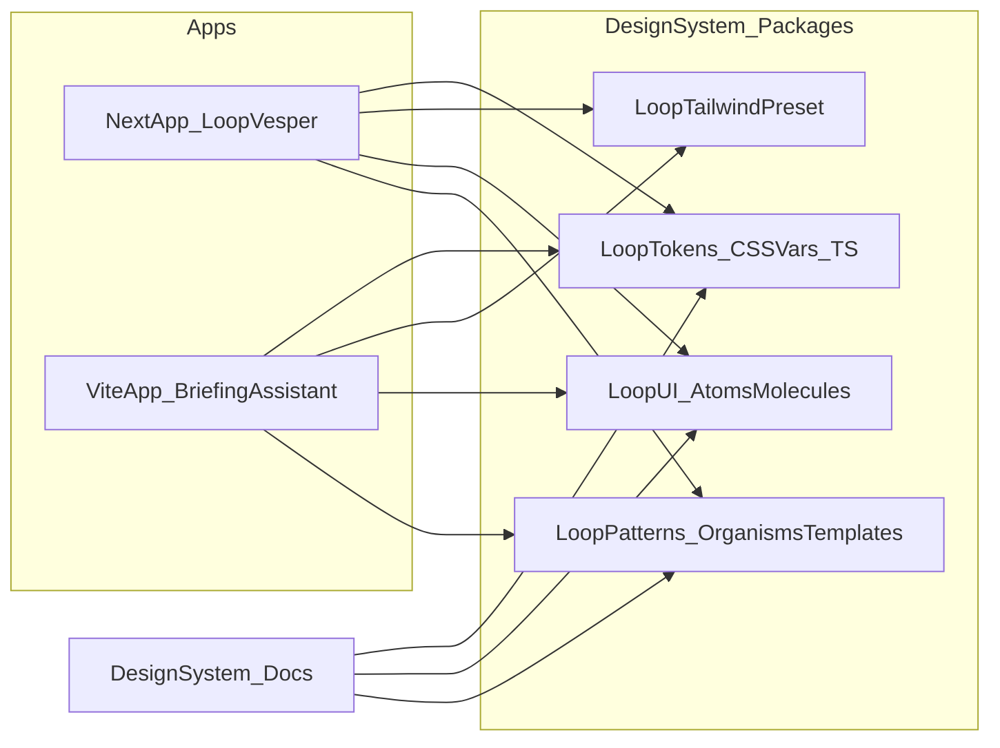

# Loop shared design system (tokens + UI + patterns)

## What you have today (good foundation)

- This repo already uses **shadcn + Tailwind CSS variables**:
  - Tokens live in [`app/globals.css`](app/globals.css) (`--background`, `--primary`, `--radius`, etc.)
  - Tailwind maps them in [`tailwind.config.ts`](tailwind.config.ts) via `hsl(var(--...))`
- Your other Loop app (`06_briefing-assistant.loop`) is **React + Vite + Tailwind + shadcn** and has a similar token setup in [`src/index.css`](src/index.css) plus extra semantic tokens (badges/table/sidebar) and “guideline utilities” (`.btn-loop`, `.card-loop`, typography helpers).

## Recommended architecture (private npm packages)

Create a dedicated **design-system repo** (monorepo just for packages + docs), publish to a private registry.

### Package split (atomic design + “brand patterns”)

- **`@loop/tokens`**
  - Outputs: CSS variables (themes), plus TS exports for programmatic use.
  - Supports multiple “dialects” as themes (ex: `loop`, `vesper`) so different repos can look different *intentionally* but remain consistent by rules.
- **`@loop/tailwind-preset`**
  - A Tailwind preset that centralizes the duplicated config you have now (container, font stack, semantic colors mapping to CSS vars, radius scale, animations).
  - Optionally a Tailwind plugin to encode “guideline utilities” currently hand-written (ex: `.btn-loop`, `.card-loop`, spacing/grid helpers) so you don’t need global CSS per app.
- **`@loop/ui`** (atoms + molecules)
  - Shadcn/Radix-based components packaged as a library.
  - Keeps shadcn conventions (CVA variants, `cn`, semantic tokens) but upgrades them into a single reusable source of truth.
- **`@loop/patterns`** (organisms + templates)
  - Opinionated “brand composition” pieces: `Navbar`, `AppShell`, `PageHeader`, `Hero`, `FeatureGrid`, `Footer`, table layouts, empty states.
  - This is where you encode “how we do navbars”, “how rounded are corners”, and “how the homepage is composed”.

## Implementation plan

### 1) Create the design-system repo

- New repo (example): `loop-design-system`
- Monorepo tooling:
  - pnpm workspaces (or npm workspaces if you prefer)
  - Changesets for versioning + release notes
  - Build with `tsup` (ESM output, preserve `"use client"`, generate `.d.ts`)
- Private publishing target:
  - Default recommendation: GitHub Packages (works well for private org packages)

### 2) Build `@loop/tokens`

- Normalize tokens into a consistent semantic set (shadcn-compatible):
  - Core: `--background`, `--foreground`, `--card`, `--primary`, `--secondary`, `--muted`, `--accent`, `--border`, `--ring`, `--radius`, etc.
  - Optional semantic extensions (from briefing assistant): badges/table/sidebar tokens.
- Add **theme files**:
  - `theme-loop.css` (derived from [`src/index.css`](src/index.css))
  - `theme-vesper.css` (derived from [`app/globals.css`](app/globals.css))
- Decide theme switching contract:
  - Recommended: `:root[data-theme="loop"]` and `:root[data-theme="vesper"] `+ `.dark` variants.

### 3) Build `@loop/tailwind-preset`

- Move the shared mapping you have in both repos’ Tailwind configs into a preset:
  - `colors: { background: "hsl(var(--background))", ... }`
  - `borderRadius` based on `--radius`
  - `container` sizing rules
  - Shared `fontFamily` defaults
- Optional: add a small Tailwind plugin for “brand utilities” (hover lift, focus ring, card styles) instead of repeating global CSS.

### 4) Build `@loop/ui` (atoms/molecules)

- Start with the components already common across both repos:
  - Button, Input, Textarea, Card, Badge, Dialog, DropdownMenu, Tabs, Toast, Select, etc.
- Make sure packaging works in both Next and Vite:
  - Output ESM
  - `react`/`react-dom` as peer deps
  - Preserve `"use client"` where needed
  - Document Tailwind `content` globs so apps compile classes from the library

### 5) Build `@loop/patterns` (organisms/templates)

- Encode the rules you mentioned:
  - **Navbars**: one or two canonical nav patterns (marketing vs app)
  - **Rounded corners**: centralized via radius tokens + component defaults
  - **Home page**: composable sections (hero, feature grid, testimonials, CTA) + a reference “Loop homepage” template

### 6) Docs: the living brand guide

- Add a docs app (Storybook or a small Next docs site) that:
  - Displays tokens and themes
  - Shows component usage + do/don’t guidance
  - Demonstrates complete patterns (Navbar/AppShell/Homepage)

## Rollout to your existing repos (incremental)

### Loop-Vesper (Next)

- Replace local tokens in [`app/globals.css`](app/globals.css) with an import from `@loop/tokens` (theme file) and set `data-theme`.
- Replace duplicated Tailwind settings in [`tailwind.config.ts`](tailwind.config.ts) with the preset.
- Gradually swap local `components/ui/*` usage to `@loop/ui` (or keep local wrappers that re-export `@loop/ui` to reduce churn).

### Briefing Assistant (Vite)

- Replace [`src/index.css`](src/index.css) token definitions + helper classes with `@loop/tokens` + preset/plugin equivalents.
- Same migration approach: re-export wrappers first, then fully adopt.

## Governance

- Changesets + semver:
  - `@loop/tokens` can ship often (safe)
  - `@loop/ui` / `@loop/patterns` should be versioned carefully (breaking changes gated)
- A simple rule: all new UI work must use tokens + components from the design system unless explicitly exempted.